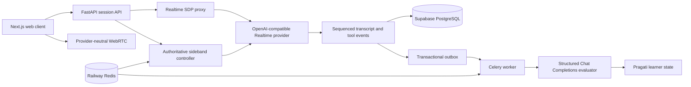

# System Architecture

## Architectural Principle

Ship the web MVP before a native client and keep all curriculum, quota, scoring, privacy, and
session-control logic behind reusable FastAPI contracts. The live path optimizes for latency,
interruptions, and durable mission state. The asynchronous path optimizes for validated evaluation,
privacy jobs, and reproducible learner updates.

The browser sends its Session Description Protocol (SDP) offer to FastAPI. FastAPI exchanges it
with the configured provider and returns only the SDP answer; the provider key never reaches the
browser. A separate backend sideband connection owns scenario transitions, tool calls, required
slots, assistance events, and completion.

## Monorepo and Runtime Boundaries

| Boundary | Implementation | Responsibility |
|---|---|---|
| Web | Next.js App Router, strict TypeScript, Tailwind, Radix, Motion, TanStack Query, XState | Public preview, authenticated shell, microphone UX, explicit voice states |
| API | FastAPI, Pydantic, SQLAlchemy, Alembic | Auth, invite, consent, quota, mission, session, privacy, and administration contracts |
| Realtime controller | Python process with Redis state | Authoritative graph state, sideband instructions, VAD and tool-event handling |
| Worker | Celery with Redis | Evaluation retries, learner updates, exports, deletion, email, and outbox delivery |
| Data | Supabase PostgreSQL and private object storage | Durable learning records and short-lived export artifacts |
| Hosting | Sites for the web; Railway for API, controller, worker, PostgreSQL connection, and Redis | Separate staging and production environments |

The OpenAPI schema in `packages/contracts/openapi.json` is generated from FastAPI. The frontend
client in `apps/web/src/lib/api/` is generated from that schema. A later Expo client can consume the
same API without reimplementing business rules.

## Realtime Provider Contract

The adapter is configured only through environment variables:

- `AI_BASE_URL`
- `AI_API_KEY`
- `AI_REALTIME_MODEL`
- `AI_EVALUATOR_MODEL`
- `AI_REALTIME_CALLS_PATH`
- `AI_REALTIME_SIDEBAND_PATH`
- `AI_CHAT_COMPLETIONS_PATH`
- connection/read timeouts and maximum concurrency

The product does not import a provider-specific client or LiveKit. Before live missions are enabled
in an environment, `scripts/provider_conformance.py` must verify:

1. OpenAI-style WebRTC SDP exchange;
2. Realtime data-channel session and audio events;
3. server-side session updates over the sideband path;
4. server voice activity detection (VAD);
5. frozen instructions and function tool calls; and
6. Chat Completions structured JSON evaluation.

Failure keeps the global live-mission switch off. The local-only scripted guest preview remains
available.

## Durable Session Workflow

1. Validate Supabase authentication, invitation redemption, adult confirmation, current core
   consent, daily quota, concurrent-session limit, mission version, feature flags, and provider
   health.
2. Create a session and freeze mission, prompt, rubric, localization, Realtime model, evaluator
   model, graph, slot, and duration versions.
3. Proxy the browser SDP offer without exposing provider credentials.
4. Maintain mission state through the backend sideband connection.
5. Persist sequenced turns, slots, assistance, timing, and connection events incrementally. Reject
   sequence gaps and treat a repeated sequence as an idempotent replay.
6. Preserve confirmed turns across at most two reconnect attempts within 20 seconds. Exhausted
   reconnects end without scoring the partial attempt.
7. Complete the durable record and write a transactional outbox job.
8. Compute task completion, slot coverage, assistance, and timing deterministically.
9. Ask the evaluator only for semantic comprehension, meaning-affecting grammar, strengths, the
   main obstacle, and the next action. Pydantic validates the response; retry delays are 5, 30, and
   120 seconds. Invalid output leaves the result pending.

## Data Model

The initial migration persists:

- users, profiles, waitlist entries, hashed invitations, and versioned consent;
- immutable mission versions and approved localizations;
- sessions, sequenced turns, assistance events, and evaluations;
- learner skill state and recommendations;
- idempotency records and daily usage ledgers;
- minimized audit events, transactional outbox jobs, and privacy jobs.

Raw voice audio is never retained in v1. The public preview stores nothing. Names, emails,
transcripts, utterances, and audio are excluded from analytics, crash reporting, and general
application logs.

## API and Failure Semantics

The API groups cover waitlist and invitations, bootstrap/profile/consent, missions, session
creation and Realtime offers, incremental turns and repair controls, completion, evaluation and
progress, privacy export/deletion, and beta administration.

All errors use one safe envelope containing a stable code, user-safe message, retryability, request
ID, and optional retry delay. `Idempotency-Key` is mandatory for invitation claims, session
creation, completion, export, and deletion. A reused key with a changed payload is rejected.

## Limits, Flags, and Reliability

Defaults are one active session per account, five sessions or 45 live minutes per account daily,
10 minutes for Coach Mode, eight minutes for Real-World Mode, and 25 global live sessions. Mission,
locale, mode, evaluator, and global kill switches must be independently controllable.

Production release targets are API availability of at least 99.5%, voice connection success of at
least 98%, valid completion of at least 97%, response-audio p95 no greater than three seconds on
supported networks, and evaluation p95 no greater than 30 seconds.

See [evaluation, privacy, and analytics](../quality/evaluation-privacy-and-analytics.md) for scoring
and retention controls, and [delivery roadmap](../delivery/roadmap.md) for rollout gates.
