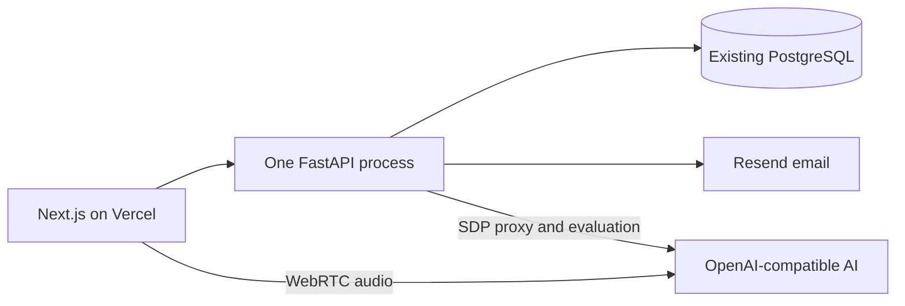

# System Architecture

## Runtime

VishwaVaani uses two application processes and one database.

The public preview is scripted and local-only. Live users request a six-digit email code, receive a
signed VishwaVaani access token, redeem an invitation, accept live-processing consent, and choose
their preferences. Authentication needs no separate identity platform.

## AI flow

FastAPI creates the durable session and proxies the browser's SDP offer. The AI key stays on the
backend. Once the SDP answer is installed, audio travels between the browser and AI provider over
WebRTC. Data-channel transcript and mission-tool events are saved incrementally to PostgreSQL; raw
audio is never saved.

When a mission completes, the same FastAPI process computes deterministic task evidence and calls
Chat Completions for validated semantic feedback. If the evaluator fails or returns invalid JSON,
the result stays pending rather than displaying made-up scores. This single-process background
work is an intentional MVP tradeoff; it can move to a durable queue later only if actual load
requires one.

## Configuration

Backend runtime configuration lives in `apps/api/.env` locally and machine environment variables
in production. Required production values are:

- `DATABASE_URL`
- `AUTH_SECRET`
- `AUTH_CODE_PEPPER`
- `RESEND_API_KEY` and `RESEND_FROM_EMAIL`
- `AI_BASE_URL`, `AI_API_KEY`, `AI_REALTIME_MODEL`, and `AI_EVALUATOR_MODEL`
- `AI_TRANSCRIPTION_MODEL` when the provider uses a different compatible transcription model
- `ADMIN_API_KEY`

Provider paths remain configurable for compatible endpoints. The frontend needs only
`NEXT_PUBLIC_API_BASE_URL` and `NEXT_PUBLIC_DEMO_MODE=false`.

## Deployment boundary

Vercel hosts only Next.js. The user's backend machine runs migrations and one Uvicorn/FastAPI
process against the user's existing PostgreSQL. Resend and the configured AI provider are the only
external services needed by the product.
