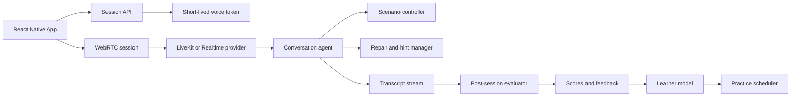

# System Architecture

## Architectural Principle

Separate live conversation from post-session evaluation. The live path optimizes for latency, interruptions, and natural turn-taking. The evaluation path optimizes for reproducible scoring, explanations, and personalization.

## Recommended Stack

| Layer | Initial choice |
|---|---|
| Mobile client | React Native with Expo |
| Live transport | WebRTC |
| Voice orchestration | LiveKit with OpenAI models |
| Prototype alternative | Direct OpenAI Realtime |
| API | FastAPI |
| Primary data | PostgreSQL |
| Queue and cache | Redis |
| Audio and exports | S3-compatible object storage |
| Product analytics | Event warehouse and BI layer |

Direct Realtime is the fastest proof-of-concept path. LiveKit is the preferred scalable path because it provides session orchestration, turn handling, token-based access, and model portability. A speech-to-text → language-model → text-to-speech pipeline remains useful for fallback flows and controlled evaluation.

## Core Boundaries

- The scenario controller owns state, required slots, branches, and success criteria.
- The conversation agent speaks in role but cannot redefine lesson goals.
- The repair manager handles repeat, slower-speech, meaning, and hint requests.
- The evaluator consumes the completed transcript and session signals asynchronously.
- The learner model stores skill state and recommends the next practice action.

Mobile clients must receive short-lived session credentials; provider secrets never ship in the app. Audio retention is opt-in and independent from the data required to deliver a live session.

See [evaluation, privacy, and analytics](../quality/evaluation-privacy-and-analytics.md) for data controls.

