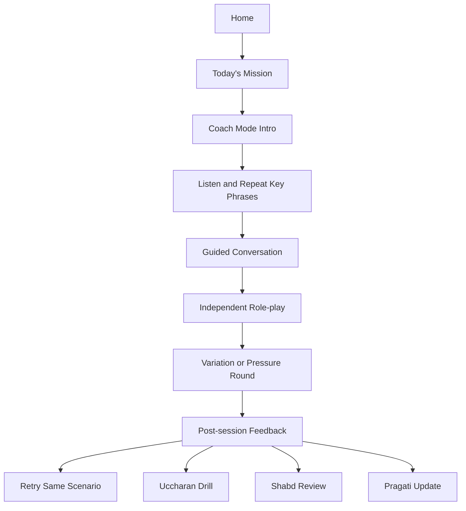
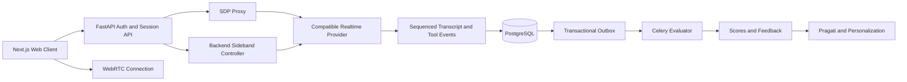
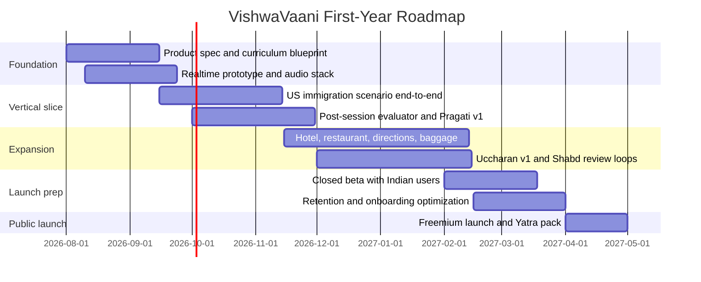

# VishwaVaani Product Plan

> **Implementation decision update — July 2026:** The production MVP is now web-first. The
> tracked implementation uses Next.js, FastAPI, Supabase, Railway, and a provider-neutral
> OpenAI-compatible Realtime adapter. It does not use React Native, Expo, LiveKit, or a
> provider-specific SDK for v1. Native clients remain a later option after the closed beta proves
> reliability and learning value. The comparison material below remains useful research context;
> current delivery decisions are authoritative in the
> [system architecture](../architecture/system-architecture.md) and
> [delivery roadmap](../delivery/roadmap.md).

## Executive summary

**VishwaVaani** should be positioned as an **India-first, voice-first English speaking coach for real-world travel and everyday international conversations**, not as a generic English-learning app. The most defensible wedge is the combination of **travel task readiness**, **repair-language training**, **accent clarity without accent erasure**, **India-specific personalization**, and **voice-first rehearsal under realistic pressure**. That positioning aligns with an obvious user need: India continues to generate large volumes of international movement, with the Ministry of Tourism dashboard reporting **32.83 million Indian National Departures in 2025**, while British Council India continues to frame English as a key enabler of education, employability, and mobility in the country. citeturn9search1turn10search7turn10search13

The learning target for the first commercial product should be **functional spoken independence from high A2 to B1**, because the CEFR B1 global and transactional descriptors explicitly emphasize being able to handle **most travel situations**, enter **unprepared conversations**, and deal with authorities, accommodation, and routine travel arrangements. The companion interaction scales also show that lower levels still need explicit support for **asking for repetition and clarification**, which should be a core design principle rather than an edge feature. citeturn14view0turn13view0turn14view1

The market is crowded but fragmented. Duolingo offers AI video calls with repeat/slow-down support and post-call transcripts; Speak is built around speaking from the first lesson with AI conversation and real-time feedback; ELSA is strong in pronunciation analysis, CEFR-linked reporting, role-plays, and native-language support; Busuu and Babbel add structured conversations and speech recognition; Loora offers broad AI English tutoring. However, the official positioning of these products remains mostly **general-purpose**, **broad-market**, or **pronunciation-centric**, rather than an India-specific travel fluency system built around immigration, hotels, taxis, restaurant orders, lost baggage, addresses, names, dates, and international accent comprehension. That is VishwaVaani’s opportunity. citeturn0search0turn0search1turn0search2turn1search0turn1search17turn1search2

The recommended first year plan is deliberately narrow. Build one excellent vertical slice around **US airport immigration**, then expand to four additional core travel scenarios: **hotel check-in, restaurant ordering, asking for directions, and missing baggage**. Deliver them in two modes: **Coach Mode** for guided practice and **Real-World Mode** for natural-speed assessment. The production MVP now ships as a **Next.js web application** backed by **FastAPI**, with direct **WebRTC audio** through a provider-neutral OpenAI-compatible Realtime contract. A backend sideband controller owns scenario state, and a structured Chat Completions evaluator handles only the semantic dimensions that deterministic evidence cannot compute. This keeps provider credentials and learning logic out of the browser and leaves the contracts reusable by a later native client. citeturn2search0turn2search2turn2search13

From a pedagogy standpoint, **Uccharan** should optimize for **intelligibility and comprehensibility**, not “sounding American.” Research summarized across pronunciation literature increasingly prioritizes **intelligibility over native-likeness**, and a modern CAPT review finds strong ongoing use of computer-assisted pronunciation training, while broader pronunciation research continues to highlight the importance of **stress, rhythm, and other suprasegmental features** alongside segmentals. Pronunciation-focused corrective feedback is useful, but the timing and intensity of feedback should be tuned carefully, because corrective feedback has benefits yet interacts with learner variability and anxiety. citeturn6search4turn6search12turn15search0turn15search2turn16search6turn16search12

Commercially, the most plausible launch model is **freemium**: a free daily practice layer, premium access to full Yatra missions and Uccharan analysis, and B2B2C or institutional extensions later for schools, universities, travel-worker programs, and test-prep/light employability settings. Exact pricing, CAC, and full budget are unspecified, so the report treats these as **planning assumptions** rather than facts.

## Market landscape and strategic position

The competitor set matters because VishwaVaani will not win by merely adding “AI voice.” The incumbents already offer voice, feedback, and structured courses. The winning move is to **choose a narrower promise** and execute it more deeply.

| Product | Official positioning and relevant features | What it proves | Strategic gap VishwaVaani can own |
|---|---|---|---|
| **Duolingo** | Duolingo’s AI **Video Call** lets learners have open-ended conversations, ask Lily to **repeat** or **slow down**, and review a **transcript** after the call; Duolingo says conversations follow a managed blueprint and level-aware system prompts. citeturn0search0turn0search4turn0search8 | Mass-market learners want low-pressure AI speaking, replay support, and transcript-led review. | Duolingo is broad and gamified; it does not foreground an India-specific travel-preparedness curriculum with operational task scoring. |
| **Speak** | Speak says its method is built to get learners **speaking from the first lesson**, with **AI conversation practice**, **real-time feedback on pronunciation and phrasing**, and a **structured curriculum** rather than open-ended chat. citeturn0search1turn11search2turn11search18 | Speaking-first can be a primary product, not just a feature. | Speak is strong on conversational practice, but its public positioning is broad general language tutoring rather than India-first travel English and repair-language readiness. |
| **ELSA Speak** | ELSA offers **pronunciation and fluency coaching**, **speech analyzer**, **AI role-plays**, **native-language learning support**, and business/school reporting mapped to **CEFR and test frameworks**. citeturn0search2turn0search10turn11search3turn11search17 | Pronunciation analytics and CEFR-linked reporting are commercially valuable; native-language scaffolding matters. | ELSA’s center of gravity is pronunciation and broad English improvement, not scenario-based travel independence for Indian learners. |
| **Busuu** | Busuu promotes **AI Conversations**, realistic scenarios, personalized feedback, pronunciation support, and progress tracking. citeturn1search0turn1search4turn1search16 | Structured conversation features are no longer rare. | Busuu is still broad “learn for real life,” not optimized for immigration, airport, hotel, or address spelling tasks for Indian users. |
| **Babbel** | Babbel uses **speech recognition** for pronunciation and launched **Everyday Conversations** with preset real-life dialogue scenarios. citeturn1search5turn1search17turn1search23 | Guided scenario dialogue remains a valid format. | Babbel tends toward shorter dialogue practice; it does not market a full voice-first, travel-mission, India-adapted speaking coach. |
| **Loora** | Loora positions itself as a **personal AI English tutor** with natural conversation and personalized feedback. citeturn1search2turn1search6 | There is clear demand for a dedicated AI English tutor. | Open-ended tutoring still leaves curriculum design, task progression, accent handling, and travel readiness under-specified. |

The practical implication is straightforward: VishwaVaani should **not** lead with “AI English tutor.” It should lead with a sharper job-to-be-done:

> **Help Indian learners become fluent enough for real travel conversations abroad, with voice-first practice for immigration, airports, hotels, restaurants, directions, and everyday public interactions.**

That positioning is supported by two public signals. First, India’s official tourism dashboard shows a large and growing base of outbound movement. Second, British Council materials on India repeatedly frame English communication as materially linked to opportunity, progression, and skills development, including spoken-English-focused programs. citeturn9search1turn10search1turn10search7turn10search13

The resulting white space is not “more content.” It is **higher task relevance**. VishwaVaani should become the product that asks: *Can the learner actually complete the immigration exchange, ask for clarification, state their address clearly, understand the follow-up, and recover from misunderstanding?* That is a stronger proposition than claiming generic “fluency.”

## Target users and learning objectives

The most important user choice is to **avoid trying to serve everyone**. The best initial user segment is the Indian learner who already has **basic school English** but struggles with **live spoken interaction**, especially under pressure.

| Persona | Likely CEFR entry band | Primary need | Typical friction | What VishwaVaani should optimize for |
|---|---|---|---|---|
| **First-time international traveler** | A1–A2 | Survive airports, immigration, hotels, transit, and food ordering | Freezes under pressure, cannot parse fast questions, knows words but cannot respond | Clear scripts that become flexible role-plays; repair phrases; task completion under moderate stress |
| **Young professional/student traveling abroad** | A2–B1 | Handle formal questions, logistics, small talk, and problem-solving | Understands textbook English but not natural pace or unexpected follow-ups | Natural-speed listening; address/name/date handling; polite requests; confidence-building |
| **Accent-anxious learner** | A2–B1 | Be understood without feeling judged or forced into accent loss | Over-focuses on “wrong accent”; under-focuses on stress, rhythm, and clarity | Uccharan with intelligibility-first feedback, not “accent removal” |
| **Habitual but inconsistent learner** | A1–B1 | Build daily speaking habit and measurable improvement | High drop-off after novelty; weak retention of phrases | Abhyaas daily loops, Shabd review, Pragati dashboards, streaks tied to speaking minutes and mission mastery |

The recommended learning objective ladder should be aligned to the CEFR, but not reduced to a single CEFR label. The CEFR’s B1 descriptors are highly relevant because they describe exactly the travel competence VishwaVaani is trying to produce: handling **most situations likely to arise while travelling**, entering **unprepared conversation** on everyday topics, and dealing with **travel, accommodation, and authorities**. The interaction scales additionally show that lower-level learners must explicitly learn clarification and turn-taking behavior, such as asking for repetition and using stock phrases when they do not understand. citeturn14view0turn13view0turn14view1

A practical objective model for VishwaVaani is:

| Level band | Real-world outcome target | Core evidence of readiness |
|---|---|---|
| **A1** | Can answer very basic personal questions when speech is slow and supportive | Name, nationality, destination, simple yes/no questions |
| **A2** | Can handle common aspects of travel, lodgings, eating, and shopping when the interaction is concrete and moderately paced | Can ask for repetition; can state simple needs; can complete routine exchanges citeturn14view0turn14view1 |
| **A2+** | Can handle multi-turn exchanges with guided support and limited variation | Can clarify key words, confirm details, manage numbers/dates |
| **B1** | Can complete most travel and service transactions and enter short unprepared conversations | Can handle immigration-style follow-ups, hotel issues, directions, simple complaints, and small talk citeturn13view0turn14view0 |

The app’s **north-star learning metric** should therefore be **task completion at target level**, not “time spent” or “words learned.” A user is improving if they move from needing hints to independently finishing realistic interactions. The most useful measurement frame is this:

| Dimension | Definition | Why it matters |
|---|---|---|
| **Task completion** | Did the learner successfully achieve the scenario goal? | This is the closest proxy to real-world usefulness. |
| **Comprehension** | Did the learner understand the question or use repair language appropriately? | Travel conversations fail more often from misunderstanding than grammar alone. |
| **Independence** | How many hints, slow-downs, translations, or retries were required? | This distinguishes rehearsal from actual readiness. |
| **Fluency** | Could the learner respond without long disruptive pauses, false restarts, or collapse? | Fluency ratings in research are strongly affected by pause behavior and pause placement. citeturn12search7turn12search22 |
| **Clarity** | Was the learner intelligible and comprehensible? | Modern L2 speaking research treats fluency, intelligibility, comprehensibility, and accentedness as related but distinct dimensions. citeturn12search0turn12search15 |
| **Grammar and phrase control** | Were mistakes frequent enough to hinder meaning? | CEFR B1 grammar accuracy explicitly allows errors, but the intended message should remain clear. citeturn13view3 |
| **Confidence** | Did the learner feel able to continue and recover? | Confidence affects willingness to speak and return to practice. |

The most important product insight here is pedagogical: **repair language is a primary skill, not a remediation tool**. A learner who can say “Could you repeat that?”, “Please speak slowly,” or “Do you mean…?” is much more travel-ready than one who memorized ideal answers but cannot recover from surprise. The CEFR interaction scales explicitly support this focus. citeturn14view1

## Curriculum, scenario engine, and module design

VishwaVaani should be organized into six modules, but they should feel like one coherent loop rather than six separate mini-products:

| Module | Product role | Core design principle |
|---|---|---|
| **Samvaad** | Guided conversational lessons | Move from supported speaking to independent response |
| **Uccharan** | Accent/pronunciation coach | Optimize intelligibility, rhythm, stress, and targeted clarity |
| **Yatra** | Travel English missions | Train concrete, high-value international scenarios |
| **Abhyaas** | Daily practice | Short recurring voice loops that preserve streaks and memory |
| **Shabd** | Vocabulary | Retrieval and spaced reactivation tied to scenarios |
| **Pragati** | Progress tracking | Show readiness, weaknesses, and next best practice |

The curriculum should be **mission-based**, not grammar-chapter-based. Travel is a transactional domain, so users should progress through real tasks:

| Mission cluster | Sample scenarios |
|---|---|
| **Airport and border** | airline check-in, security, boarding, immigration, customs, baggage |
| **Arrival and stay** | taxi/rideshare, asking directions, hotel check-in/out, room issue |
| **Food and payment** | restaurant ordering, dietary needs, café, shopping, paying |
| **Social basics** | introductions, small talk, requests, apologies, invitations |
| **Problem solving** | lost passport, pharmacy, incorrect bill, missed connection |

The **initial MVP scenario set** should be narrow enough to polish:

| Priority | Scenario | Why it belongs in MVP |
|---|---|---|
| **Highest** | **US immigration interview** | Strongest vertical slice; tests identity, purpose, dates, accommodation, follow-up handling |
| High | Hotel check-in | Complex enough for names, booking details, room issues |
| High | Restaurant ordering | Daily relevance; works well for repetition, variation, and pronunciation |
| High | Asking for directions | Forces clarification, confirmation, and location language |
| High | Missing baggage | High-stress task that proves real-world utility |

Progression should follow a simple rule: **listen → repeat → respond with help → respond independently → handle variation → handle pressure**. This is consistent with what the CEFR interaction descriptors imply: users need explicit support at lower levels, then increasing autonomy and control. citeturn14view0turn14view1

A good scenario engine should be **constrained but variable**. The AI should not invent the whole lesson from scratch. It should operate inside a graph or state machine with slots, success criteria, and controlled branches.

```json
{
  "$schema": "https://json-schema.org/draft/2020-12/schema",
  "title": "VishwaVaaniScenario",
  "type": "object",
  "required": [
    "scenario_id",
    "module",
    "cefr_target",
    "title",
    "agent_role",
    "learner_goal",
    "required_information",
    "nodes",
    "progression_rules",
    "assessment"
  ],
  "properties": {
    "scenario_id": { "type": "string" },
    "module": { "type": "string", "enum": ["Samvaad", "Uccharan", "Yatra", "Abhyaas", "Shabd"] },
    "cefr_target": { "type": "string", "enum": ["A1", "A2", "A2+", "B1"] },
    "title": { "type": "string" },
    "agent_role": {
      "type": "object",
      "required": ["title", "demeanor", "accent_profile", "speed_profile"],
      "properties": {
        "title": { "type": "string" },
        "demeanor": { "type": "string" },
        "accent_profile": { "type": "string" },
        "speed_profile": { "type": "string" }
      }
    },
    "learner_goal": {
      "type": "array",
      "items": { "type": "string" }
    },
    "required_information": {
      "type": "object",
      "additionalProperties": { "type": ["string", "number", "boolean"] }
    },
    "allowed_assistance": {
      "type": "object",
      "properties": {
        "repeat_request": { "type": "boolean" },
        "slower_speech": { "type": "boolean" },
        "phrase_hint": { "type": "boolean" },
        "native_language_hint": { "type": "boolean" }
      }
    },
    "nodes": {
      "type": "array",
      "items": {
        "type": "object",
        "required": ["node_id", "intent", "success_criteria"],
        "properties": {
          "node_id": { "type": "string" },
          "intent": { "type": "string" },
          "prompt_templates": {
            "type": "array",
            "items": { "type": "string" }
          },
          "expected_slots": {
            "type": "array",
            "items": { "type": "string" }
          },
          "success_criteria": {
            "type": "array",
            "items": { "type": "string" }
          },
          "fallback_strategy": { "type": "string" },
          "next_nodes": {
            "type": "array",
            "items": { "type": "string" }
          }
        }
      }
    },
    "progression_rules": {
      "type": "object",
      "properties": {
        "pass_threshold": { "type": "number" },
        "no_hint_mastery_threshold": { "type": "number" },
        "variation_unlock_threshold": { "type": "number" },
        "pressure_mode_unlock_threshold": { "type": "number" }
      }
    },
    "assessment": {
      "type": "object",
      "properties": {
        "required_task_outcomes": {
          "type": "array",
          "items": { "type": "string" }
        },
        "scoring_weights": {
          "type": "object",
          "additionalProperties": { "type": "number" }
        }
      }
    }
  }
}
```

A corresponding evaluator payload should be structured enough for dashboards and personalization.

```json
{
  "$schema": "https://json-schema.org/draft/2020-12/schema",
  "title": "PostSessionEvaluation",
  "type": "object",
  "required": [
    "session_id",
    "scenario_id",
    "task_completion",
    "scores",
    "error_patterns",
    "strengths",
    "next_actions"
  ],
  "properties": {
    "session_id": { "type": "string" },
    "scenario_id": { "type": "string" },
    "task_completion": {
      "type": "object",
      "properties": {
        "completed": { "type": "boolean" },
        "required_slots_filled": {
          "type": "array",
          "items": { "type": "string" }
        },
        "missed_slots": {
          "type": "array",
          "items": { "type": "string" }
        }
      }
    },
    "scores": {
      "type": "object",
      "required": [
        "comprehension",
        "independence",
        "fluency",
        "clarity",
        "grammar",
        "confidence"
      ],
      "properties": {
        "comprehension": { "type": "number", "minimum": 0, "maximum": 1 },
        "independence": { "type": "number", "minimum": 0, "maximum": 1 },
        "fluency": { "type": "number", "minimum": 0, "maximum": 1 },
        "clarity": { "type": "number", "minimum": 0, "maximum": 1 },
        "grammar": { "type": "number", "minimum": 0, "maximum": 1 },
        "confidence": { "type": "number", "minimum": 0, "maximum": 1 }
      }
    },
    "error_patterns": {
      "type": "array",
      "items": {
        "type": "object",
        "properties": {
          "category": { "type": "string" },
          "example": { "type": "string" },
          "impact": { "type": "string", "enum": ["low", "medium", "high"] },
          "suggested_fix": { "type": "string" }
        }
      }
    },
    "strengths": {
      "type": "array",
      "items": { "type": "string" }
    },
    "next_actions": {
      "type": "object",
      "properties": {
        "recommended_review_items": {
          "type": "array",
          "items": { "type": "string" }
        },
        "recommended_next_scenario": { "type": "string" },
        "recommended_uccharan_drills": {
          "type": "array",
          "items": { "type": "string" }
        }
      }
    }
  }
}
```

For **Uccharan**, the design recommendation is to explicitly reject “accent reduction” as the primary promise. Research on L2 pronunciation increasingly prioritizes **intelligibility and comprehensibility**, CAPT research shows continuing value in computer-assisted pronunciation feedback, and studies on stress and suprasegmental instruction support working on **word stress, rhythm, and prosody**, not just consonants and vowels. Pronunciation-focused corrective feedback is helpful, but not all learners benefit from the same timing or intensity, so VishwaVaani should mix **light in-flow cues** with **richer post-session review**. citeturn6search4turn6search12turn15search0turn15search2turn16search6turn16search12

A practical **Uccharan exercise set** should include:

| Exercise type | Why it matters |
|---|---|
| **Minimal pairs and near-minimal pairs** | Useful for high-confusion segmentals and Indian-English-specific substitutions |
| **Word stress drills** | Strong support in pronunciation literature for intelligibility impact of stress placement citeturn15search0turn15search8 |
| **Sentence rhythm and thought groups** | Supports more natural comprehensibility, pacing, and processing |
| **Shadowing and chunk repetition** | Helps rhythm, connected speech, and automaticity |
| **Name/date/address drills** | High-value travel content; should be personalized with the learner’s data |
| **Accent comprehension mode** | Practice listening to American, British, and international English at multiple speeds |
| **Noise mode** | Travel environments are noisy; comprehension should not be measured only in studio-grade audio |

The destination-pack idea becomes valuable once the core system works. Start with **US**, then add **UK**, **Schengen/Europe**, and **Gulf** packs. These should not change the grammar syllabus; they should change **situational wording**, **common service phrases**, **date/number conventions**, and **accent exposure**.

## Voice-first UX and technical architecture

The best user experience is radically simple: open the app, tap one big voice control, and start speaking. The home screen should not look like a textbook. It should feel more like a **mission dashboard**.

A recommended session loop is:



This structure is supported by what current speaking products already validated. Duolingo’s Video Call includes asking the AI to **repeat** or **slow down**, keeps the environment **low pressure**, and offers a **transcript** after the session. Those are not gimmicks; they are exactly the scaffolds early VishwaVaani learners will need. citeturn0search0turn0search8

The UI should have these defining patterns:

| UX element | Recommendation | Rationale |
|---|---|---|
| **Primary CTA** | “Start speaking” or “Start today’s mission” | Keeps the app voice-first |
| **Large voice button** | Centered, thumb-friendly, persistent on speaking screens | Reduces hesitation and improves one-handed use |
| **Thinking-time tolerance** | Wait through longer pauses before stepping in | Many learners need formulation time; interruption should feel supportive, not punitive |
| **Coach Mode** | Slower voice, optional hints, optional translation, visible transcript, immediate rescue | Appropriate for A1–A2 learners |
| **Real-World Mode** | Natural speed, no visible transcript during task, delayed feedback only, realistic follow-ups | Needed for actual task-readiness assessment |
| **Transcript policy** | Hidden by default during test mode; available after completion | Prevents reading dependence but preserves review value |
| **Repair controls** | Dedicated quick actions: “Repeat”, “Slower”, “What does that mean?” | Aligns directly with CEFR clarification needs citeturn14view1 |
| **Accessibility** | Respect screen readers, 48-pixel controls, visible focus, reduced motion, mic permissions, and explicit audio state | The web MVP targets WCAG 2.2 AA and tests keyboard, screen-reader, long native-script, reduced-motion, and denied-microphone behavior. |

A lightweight wireframe sketch is below.

```text
┌──────────────────────────────────────┐
│ VishwaVaani                          │
│ Today's goal: US Immigration         │
│ Readiness: 42%                       │
├──────────────────────────────────────┤
│  Coach Mode   ○        Real World ●  │
│                                      │
│     [ Officer avatar / waveform ]    │
│                                      │
│   "Good afternoon. May I see your    │
│    passport?"                        │
│                                      │
│              ● HOLD TO SPEAK         │
│                                      │
│  Repeat   Slower   Hint   Transcript │
└──────────────────────────────────────┘
```

On the technical side, the fundamental architecture should separate **live conversation** from **post-session evaluation**. Live interaction optimizes for latency and turn-taking; evaluation optimizes for reliability and structured scoring.



The production choice is a provider-neutral adapter over the OpenAI-compatible **WebRTC** and
**server-control** contracts. FastAPI proxies the browser SDP offer, while the backend sideband
controller owns graph state, instructions, Voice Activity Detection (VAD), repair events, and tool
calls. Deployment conformance must pass before the live feature flag is enabled; failure leaves the
scripted local preview available. The earlier LiveKit comparison remains background research, not
the v1 runtime decision. citeturn2search0turn2search2

| Stack choice | Advantages | Drawbacks | Decision |
|---|---|---|---|
| **Compatible Realtime + WebRTC** | Low-latency browser path, no provider key in the client, and a portable event contract. | Requires custom sideband control, conformance, observability, and reconnect handling. | **Production MVP** |
| **LiveKit orchestration** | Mature room and agent abstractions. | Adds an orchestration dependency and provider-specific operating model before the core loop is proven. | Deferred |
| **Pure STT → LLM → TTS pipeline** | Granular control and substitution. | More latency and moving parts. | Evaluation/fallback research only |

A practical backend recommendation is:

| Layer | Recommended choice | Why |
|---|---|---|
| Web client | **Next.js App Router** | Responsive closed beta before native investment; strict TypeScript and accessible browser audio |
| Voice transport | **WebRTC** | Best fit for live browser audio according to OpenAI-style contracts. citeturn2search0turn2search2 |
| Voice orchestration | **Custom FastAPI sideband controller** | Keeps mission state, tools, and provider secrets server-side without LiveKit |
| Conversation model | **Configurable compatible Realtime model** | Model and provider are deployment configuration, not client code |
| API backend | **FastAPI** | Reusable contracts for web and later native clients |
| Primary database | **Supabase PostgreSQL** | Learner, mission, session, consent, quota, audit, and outbox records |
| Queue/cache | **Railway Redis + Celery** | Realtime state, background evaluation, and privacy jobs |
| Object storage | **Private Supabase storage** | Short-lived export artifacts; v1 never retains raw audio |
| Analytics | **PostHog allowlist** | Content-free product events and feature flags |

## Evaluation, personalization, privacy, and analytics

VishwaVaani’s scoring should look more like a **language-performance dashboard** than a school exam. Users should see where they succeeded and what blocked them. The scoring taxonomy below is both pedagogically defensible and product-useful.

| Metric | What to score | Suggested observable signals | Supporting basis |
|---|---|---|---|
| **Task completion** | Whether the scenario goal was achieved | Required slots filled; service task resolved | CEFR transactional and travel descriptors prioritize functional ability. citeturn13view0turn14view0 |
| **Comprehension** | Whether the user understood live questions | Correct answer match, repair requests, off-topic replies | CEFR listening and clarification scales support this. citeturn14view0turn14view1 |
| **Independence** | Reliance on hints and scaffolds | Hint count, slow-down use, translation taps | Product metric derived from assisted→unassisted progression |
| **Fluency** | Flow of speech | Silent pause rate, within-clause pauses, self-repairs, abandoned starts | Perceived fluency research emphasizes pause rate and pause location. citeturn12search7turn12search22 |
| **Clarity** | Intelligibility and comprehensibility | ASR confidence, human-rated audits, listener success tasks | L2 speech research treats intelligibility/comprehensibility as distinct central constructs. citeturn12search0turn12search15 |
| **Grammar** | Meaning-preserving control | Error density, impact on interpretation | CEFR B1 allows noticeable errors if meaning remains clear. citeturn13view3 |
| **Confidence** | Readiness to continue | Self-rating, retry behavior, completion under pressure | Best collected partly by self-report, not inferred from loudness alone |

This system should feed a **learner model** that remembers:

- current CEFR-like level by skill band;
- strongest and weakest scenario families;
- recurring phrase and grammar errors;
- pronunciation patterns by category;
- comprehension difficulty by accent/speed/noise condition;
- personalization facts such as name, destination, dietary needs, and travel dates;
- habit and retention signals, including streak fragility and best practice time.

That learner model powers the next-best actions: *repeat hotel check-in with a British voice*, *practice word stress on accommodation words*, *review passport, booking, and room phrases*, *unlock baggage claim only after directions score improves*, and so on.

From a privacy standpoint, VishwaVaani should treat **voice recordings, transcripts, learner profiles, and evaluation outputs as personal data by default**. India’s **Digital Personal Data Protection Act, 2023** establishes lawful processing requirements for digital personal data, and the EU GDPR applies extraterritorially when processing data of people in the Union. The ICO’s guidance is also useful operationally because it emphasizes transparency, retention disclosure, and that valid consent must be **freely given**, **specific**, and **easily withdrawable**. citeturn5search0turn5search10turn5search1turn5search5turn5search8turn5search14

The minimum privacy architecture should be:

| Privacy control | Recommendation | Why |
|---|---|---|
| **Granular consent** | Separate toggles for core processing, saved recordings, and model-improvement/training use | Consent should not be bundled; withdrawal must be practical. citeturn5search5turn5search14 |
| **Data minimization** | Store only what is needed for teaching and support | Aligns with GDPR principles and good product governance. citeturn5search1turn5search2 |
| **Retention policy** | Publish explicit retention windows for audio, transcripts, and analytics | Users have a right to know purposes and retention. citeturn5search8 |
| **Deletion/export** | In-app delete account and export transcript/result history; no recording controls are needed because v1 retains no raw audio | Strong trust signal and compliance support |
| **Training opt-in** | Never use learner audio for model improvement without explicit, separate permission | Higher sensitivity and reputational risk |
| **Child safety** | If serving minors, add guardian consent and age gating | Required if later expanding into schools |
| **Security** | Encrypt at rest, encrypt in transit, least-privilege admin access, audit logs | Necessary for voice and profile data |
| **Regional handling** | Be ready for region-specific data flows if serving EU/UK residents | GDPR reach can apply even to firms outside the EU. citeturn5search10turn5search22 |

Analytics should be designed for pedagogy, not vanity. The essential event stream is: **mission started, first response latency, repair request used, hint used, scenario completed, retry, next-day return, pronunciation drill launched, vocabulary reviewed, transcript opened, subscription conversion**. Those events enable the real optimization questions: which scenario causes dropout, which hint types actually improve independence, which Uccharan drills transfer into Yatra success, and which accents most reduce comprehension.

## Roadmap, staffing, costs, risks, and go-to-market

The right MVP is small enough to finish and rich enough to prove the teaching model. The **vertical slice** should be **US immigration** because it exercises the hardest product requirements at once: identity details, real-time listening, repair phrases, follow-up questions, transcript review, scoring, and confidence under mild pressure.

| MVP feature | Include in first release? | Why |
|---|---|---|
| US immigration scenario | **Yes** | Core vertical slice |
| Coach Mode and Real-World Mode | **Yes** | Essential product differentiation |
| Repeat/slower/help controls | **Yes** | Critical for A1–A2 users |
| Post-session transcript | **Yes** | Strong learning affordance validated by competitors citeturn0search8 |
| Structured feedback summary | **Yes** | Required for retention and improvement |
| Basic Pragati dashboard | **Yes** | Users need proof of progress |
| Uccharan mini-drills tied to the scenario | **Yes** | Turns feedback into action |
| Shabd review of high-value phrases | **Yes** | Reinforces retention |
| Dozens of destinations | **No** | Too much breadth too early |
| Avatar-heavy visual polish | **No** | Not required to prove value |
| Social leaderboard | **No** | Low priority before core learning loop |
| Full offline voice mode | **No** | Expensive and unnecessary for MVP |

A realistic first-year roadmap looks like this.



The same roadmap in operational terms:

| Quarter | Primary goal | Exit criteria |
|---|---|---|
| **Q1** | Foundation and prototype | Working voice session, one scripted scenario, transcript logging |
| **Q2** | End-to-end vertical slice | US immigration with Coach/Real-World modes, evaluator, Pragati v1 |
| **Q3** | MVP breadth | 4–5 travel scenarios, Uccharan v1, Shabd reviews, onboarding polish |
| **Q4** | Launch and retention | Closed beta, conversion tests, freemium launch, first destination pack |

A lean founding team can build this, but the product will fail without curriculum and speech-pedagogy depth. The recommended team shape is:

| Role | Priority | Typical scope |
|---|---|---|
| Product founder / CEO | Critical | Strategy, hiring, GTM, curriculum prioritization |
| Product designer | Critical | Voice-first UX, onboarding, feedback surfaces |
| Full-stack web engineer | Critical | Next.js, browser audio, accessibility, API integration |
| Backend / realtime engineer | Critical | FastAPI, WebRTC, sideband control, evaluator pipelines |
| Applied AI engineer | Critical | Prompting, evaluation, scenario control, data pipelines |
| Curriculum and pedagogy lead | Critical | CEFR mapping, scenario scripts, correction policy |
| Speech/pronunciation specialist | High | Uccharan design, phonology taxonomy, drill design |
| QA / user research | High | Device testing, learner interviews, scenario audits |
| Growth / content ops | Later | App store, referral loops, community, partnerships |

Because exact salaries and operating assumptions are unspecified, the following budget is **illustrative only** for a 12-month pre-seed build:

| Team configuration | Approximate annual cash burn assumption |
|---|---|
| **Lean 5–6 person India-first team** | **US$220k–US$420k** |
| **Stronger 7–9 person product + pedagogy team** | **US$400k–US$850k** |
| **Add paid model usage, infra, tooling, user research** | **Add ~US$40k–US$180k**, highly usage-dependent |

The largest risks and mitigations are predictable.

| Risk | Why it matters | Mitigation |
|---|---|---|
| **Latency or turn-taking feels bad** | Voice products fail fast when conversation feels unnatural | Start with narrow scenarios, test on low-end Indian devices, use WebRTC and proven turn-handling defaults. citeturn2search0turn3search18 |
| **Feedback feels judgmental** | Learners may stop speaking if corrected too aggressively | Keep in-flow feedback light; give richer delayed summaries; personalize intensity. citeturn16search6turn16search12 |
| **ASR errors on Indian speech distort scoring** | Unfair scoring destroys trust | Use listener-success heuristics, error calibration, and periodic human audit sets |
| **Curriculum is too generic** | Product becomes replaceable by general AI tutors | Personalize context deeply with Indian names, destinations, diet, and common travel tasks |
| **Privacy trust gap** | Voice data is sensitive | Use granular consent, retention disclosure, and deletion controls from day one. citeturn5search5turn5search8turn5search14 |
| **Retention collapse after novelty** | Speaking apps often feel impressive but non-habitual | Keep Abhyaas under 5 minutes, tie streaks to speaking, and surface visible Pragati gains |

The most plausible go-to-market path is **India-first consumer**, then **institutional adjacency**. The initial acquisition language should emphasize **confidence abroad**, **real speaking practice**, and **clear speech without accent erasure**. Good early channels include study-abroad communities, travel communities, airport/travel creator partnerships, Indian language YouTube creators, and campus/young-professional cohorts. Later expansion can target schools, colleges, and service-industry training, especially because competing products like ELSA and Speak already validate school/business demand for speaking analytics and institutional reporting. citeturn11search3turn11search14

On branding, **VishwaVaani** is strong at the umbrella level because it expresses “voice for the world.” **Uccharan** works best as the pronunciation and accent-clarity layer precisely because it sounds Indian-rooted and functionally descriptive. The best brand promise is not “perfect English.” It is:

> **VishwaVaani — Speak confidently with the world.**  
> **Uccharan — Speak clearly. Be understood everywhere.**

For reference, the most important source documents to keep on the founding team’s desk are the **CEFR Companion Volume**, official product material from **Duolingo**, **Speak**, **ELSA**, **Busuu**, and **Babbel**, official developer documentation from **OpenAI Realtime** and **LiveKit**, and the privacy/regulatory texts behind **India’s DPDP Act** and the **GDPR**. citeturn0search3turn0search0turn0search1turn0search2turn1search0turn1search17turn2search0turn2search13turn3search0turn5search0turn5search1
